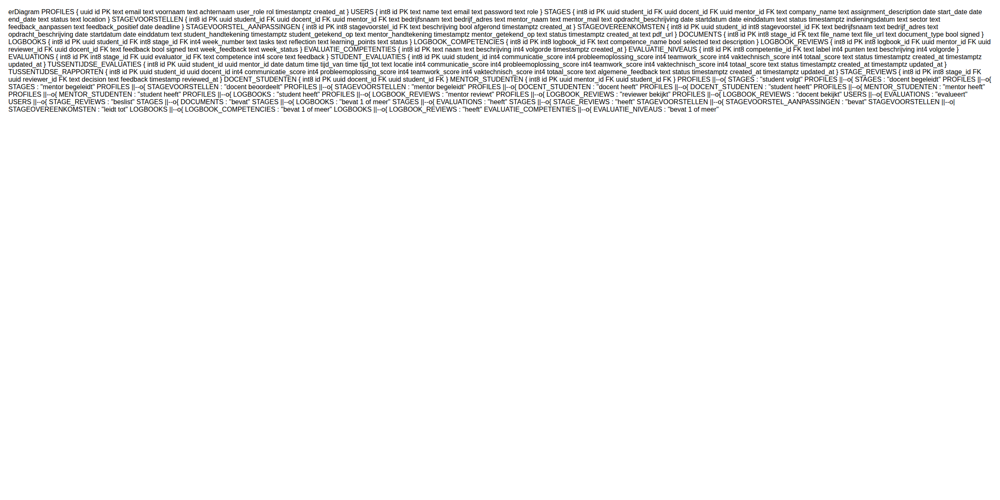

Stage Monitoring Tool
📌 Projectbeschrijving
Deze webapplicatie is ontwikkeld als eindwerk voor de opleiding Toegepaste Informatica aan de Erasmushogeschool Brussel. De Stage Monitoring Tool digitaliseert en centraliseert het volledige stageproces — van aanvraag tot eindevaluatie — voor studenten, docenten, mentoren, de stagecommissie en de administratie.

De tool vervangt het versnipperde, manuele proces en biedt een transparante, flexibele en schaalbare oplossing waarbij competenties en evaluatiecriteria eenvoudig aanpasbaar blijven zonder code-aanpassingen.

🚀 Project opstarten
Clone de repository en start de applicatie:

git clone https://github.com/Anissa321/stage-monitoring-tool.git
cd stage-monitoring-tool/frontend
npm install
npm run dev
De applicatie is beschikbaar op: http://localhost:5173

🔐 Testaccounts
Rol	E-mail	Wachtwoord
Student	test@ehb.be	Test123!
Docent	docent@ehb.be	Docent123!
Mentor	mentor@ehb.be	Mentor123!
Stagecommissie	commissie@ehb.be	Commissie123!
Administratie	administratie@ehb.be	Admin123!
💡 De mentor krijgt toegang tot stagiaires nadat de commissie hem/haar koppelt aan een student.

🎯 Functionaliteiten
👤 Rollen & toegang
De applicatie werkt met rolgebaseerde toegang. Elke gebruiker ziet enkel wat relevant is voor zijn/haar rol.

🎓 Student
Stagevoorstel indienen met bedrijfsgegevens, opdrachtomschrijving en periode
Status van het voorstel opvolgen (ingediend, aanpassingen vereist, goedgekeurd, afgekeurd)
Stageovereenkomst digitaal ondertekenen
Wekelijks logboek invullen met uitgevoerde taken, reflectie en leerpunten
Competenties beschrijven en eigen vorderingen toelichten
Tussentijdse evaluaties raadplegen
Eindevaluatie en eindoverzicht bekijken
🏫 Stagecommissie
Stagevoorstellen beoordelen: goedkeuren, afkeuren of aanpassingen vragen met feedback
Overzicht van alle ingediende stagevoorstellen en hun status
Stageovereenkomsten controleren
Eindevaluaties en eindoverzichten per student raadplegen
👨‍🏫 Docent
Toegewezen studenten opvolgen
Wekelijkse logboeken inkijken
Tussentijdse evaluaties registreren en feedback geven
Competentiescores toekennen
Eindoverzicht per student raadplegen
🏢 Mentor (bedrijf)
Wekelijkse logboeken van de stagiaire inkijken en afchecken
Wekelijkse feedback geven
Tussentijdse evaluaties registreren
Stageovereenkomst digitaal ondertekenen
⚙️ Administratie
Gebruikersaccounts aanmaken voor alle rollen
Mentoren koppelen aan studenten
Competenties beheren (toevoegen, wijzigen, verwijderen)
Evaluatieniveaus en rubrics beheren
📋 Stageproces — overzicht
Fase 1: Student dient stagevoorstel in
        ↓
Fase 2: Stagecommissie beoordeelt (goedgekeurd / afgekeurd / aanpassingen vereist)
        ↓
Fase 3: Stageovereenkomst wordt opgeladen en ondertekend
        ↓
Fase 4: Wekelijkse logboeken tijdens de stage
        ↓
Fase 5a: Tussentijdse evaluatie/bespreking
        ↓
Fase 5b: Finale evaluatie op competenties + eindoverzicht
🗂️ ERD

🛠️ Technologieën
Laag	Technologie
Frontend	Vue.js, Vite
Backend	Node.js, Express.js
Database	Supabase (PostgreSQL)
Authenticatie	Supabase Auth
Opslag	Supabase Storage
Backend routes
Route	Beschrijving
/auth	Authenticatie & sessies
/gebruikers	Gebruikersbeheer
/stagevoorstellen	Stagevoorstellen beheren
/stageovereenkomsten	Overeenkomsten & handtekeningen
/logboeken	Wekelijkse logboeken
/evaluatieCompetencies	Competenties & rubrics
/studentEvaluaties	Finale evaluaties
/tussentijdseEvaluaties	Tussentijdse besprekingen
/tussentijdseRapporten	Tussentijdse rapporten
/dashboards	Dashboarddata per rol
👨‍💻 Team
Anissa Canton Rodriguez
Insaf Hadour
Artin Ghandfatehi
📆 Deadline
Het project moet afgewerkt en gepresenteerd worden tegen 22 juni 2026.

📚 Bronnen
Supabase documentatie
Vue.js documentatie
W3Schools
ChatGPT
Cursor AI